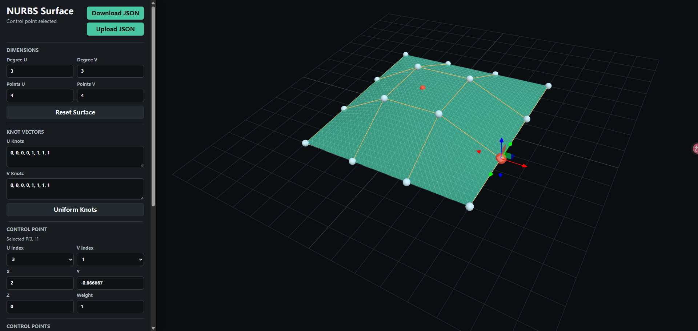

# NurbsSurfaceDisplay

NurbsSurfaceDisplay 是一个基于浏览器的交互式 NURBS 曲面可视化工具。它支持编辑 NURBS 曲面定义，在 Three.js 三维视口中查看曲面结果，直接拖拽控制点，并将曲面数据导入或导出为 JSON。

## 效果预览



## 当前功能支持

- 三维 NURBS 曲面渲染，包含实体曲面、线框叠加、控制网格和控制点标记。
- 支持编辑 U/V 两个方向的曲面阶数。
- 支持编辑 U/V 两个方向的控制点数量。
- 支持编辑 U/V 节点向量。
- 节点向量校验：长度、数值有效性、非递减顺序和有效参数域。
- 一键生成开放均匀节点向量。
- 支持编辑控制点的 `x`、`y`、`z` 坐标和有理权重 `w`。
- 支持通过三维视口、下拉选择器、跳转输入框或完整控制点列表选择控制点。
- 支持使用三维变换控件拖拽选中的控制点，并实时更新曲面。
- 三维视口和控制点列表之间支持悬停与选中高亮联动。
- 支持通过滑块或数值输入设置 U/V 参数并计算曲面点。
- 显示求值点的 `x`、`y`、`z` 坐标，并在曲面上用红色标记显示该点。
- 支持重置为默认示例曲面。
- 支持 JSON 导入，并对导入数据进行结构归一化和校验。
- 支持导出当前有效的曲面定义为 JSON。
- 支持桌面端和较小屏幕的响应式布局。

## 运行方式

在项目根目录使用任意静态文件服务器启动，例如：

```powershell
python -m http.server 4173
```

然后在浏览器中打开：

```text
http://localhost:4173
```

页面会从 jsDelivr 加载 Three.js 模块，因此默认需要网络访问。如果希望离线运行，需要将相关依赖本地化。

## JSON 数据格式模板

```json
{
  "degreeU": 3,
  "degreeV": 3,
  "knotsU": [0, 0, 0, 0, 1, 1, 1, 1],
  "knotsV": [0, 0, 0, 0, 1, 1, 1, 1],
  "controlPoints": [
    [
      [-2, -2, 0, 1],
      [-2, -0.667, 0, 1],
      [-2, 0.667, 0, 1],
      [-2, 2, 0, 1]
    ],
    [
      [-0.667, -2, 0, 1],
      [-0.667, -0.667, 0.9, 1.6],
      [-0.667, 0.667, 0.9, 1],
      [-0.667, 2, 0, 1]
    ],
    [
      [0.667, -2, 0, 1],
      [0.667, -0.667, 0.9, 1],
      [0.667, 0.667, 0.9, 1],
      [0.667, 2, 0, 1]
    ],
    [
      [2, -2, 0, 1],
      [2, -0.667, 0, 1],
      [2, 0.667, 0, 1],
      [2, 2, 0, 1]
    ]
  ]
}
```

`controlPoints` 使用二维数组表达控制点网格，不是一维数组按 4 个数字切分。

数组层级含义如下：

- 第一层数组表示 U 方向的控制点行。
- 第二层数组表示该 U 行内 V 方向的控制点列。
- 第三层数组才是单个控制点，固定为 `[x, y, z, w]`。

例如：

```json
"controlPoints": [
  [
    [-2, -2, 0, 1],
    [-2, 0, 0.5, 1],
    [-2, 2, 0, 1]
  ],
  [
    [0, -2, 0, 1],
    [0, 0, 1, 1.4],
    [0, 2, 0, 1]
  ]
]
```

这里表示一个 `2 x 3` 的控制点网格：U 方向有 2 行，V 方向每行有 3 列。每个 `[-2, -2, 0, 1]` 这样的四元数组表示一个控制点，四个值依次是 `x`、`y`、`z` 和权重 `w`。

## 数据约束说明

- `degreeU` 和 `degreeV` 必须是正整数。
- `controlPoints` 必须是矩形二维数组，所有行的列数必须一致。
- U 方向控制点数量为 `controlPoints.length`，记为 `countU`。
- V 方向控制点数量为 `controlPoints[0].length`，记为 `countV`。
- 必须满足 `degreeU < countU`，并且 `degreeV < countV`。
- 每个控制点必须是 `[x, y, z, w]` 四元数组。
- `x`、`y`、`z`、`w` 都必须是有效数值，且 `w > 0`。
- `knotsU` 的长度必须等于 `countU + degreeU + 1`。
- `knotsV` 的长度必须等于 `countV + degreeV + 1`。
- `knotsU` 和 `knotsV` 必须按非递减顺序排列。
- U 方向有效参数域为 `[knotsU[degreeU], knotsU[countU]]`，并且必须满足 `knotsU[degreeU] < knotsU[countU]`。
- V 方向有效参数域为 `[knotsV[degreeV], knotsV[countV]]`，并且必须满足 `knotsV[degreeV] < knotsV[countV]`。

导入 JSON 或编辑表单时，如果数据不满足这些约束，页面会通过状态栏和弹框提示具体错误。
